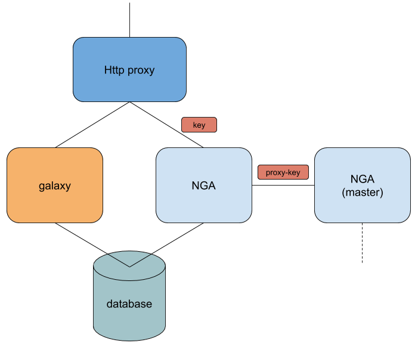
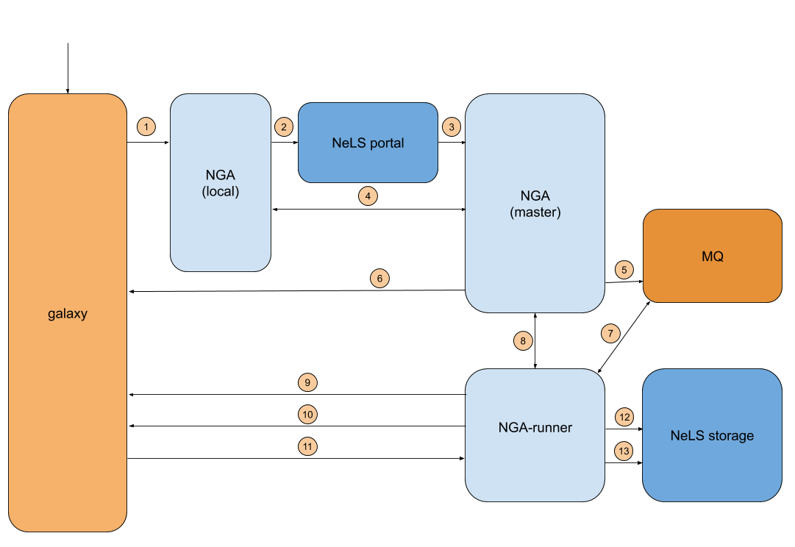
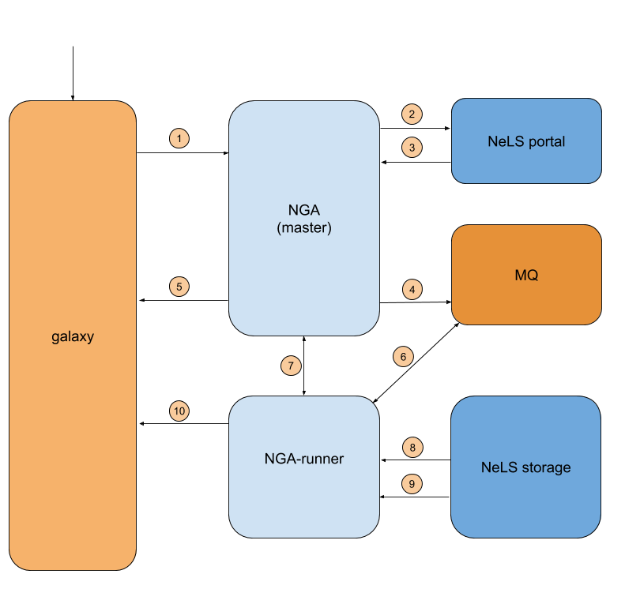

# nels-galaxy-api  (NGA)

---
**DEPRECATION NOTICE**: nels-galaxy-api version available at this repository is considered **obsolete**  and must not be used anymore.

Instead, you must use the last NGA version available at UiB Gitlab: <https://git.app.uib.no/cbu-dev/nga>

---

The NeLS-galaxy-api extend the existing galaxy api with some additional functionality 

* basic information eg: user, jobs, exports, etc
* Terms of Service agreement registering
* History export into the NeLS storage system 
* running the export/import of histories to/from the NeLS storage
 
To get a galaxy to display the history export progress a special version of the welcome.html is required. 
This **is** be part of the normal nels-galaxy or usegalaxy ansible playbooks and not included here. 
 
A simple diagram:



Note that the client needs a key to access the more sensetive endpoints, and if NGA instance is acting as 
a proxy for the master NGA, it needs a proxy-key to allow the connection 


An ansible role is available for the deployment of the old version of the software as well at: https://github.com/usegalaxy-no/ansible-role-nels-galaxy-api

## Installation


Installation consists of 4 steps

1. install and configure the nels-galaxy-api
3. configure the https proxying
4. add and configure the webhook plugin to galaxy  
5. running the server in production mode.

Once the service is up and running you will need to 5. share the galaxy admin api-key (from the webinterface) 
with the usegalaxy admin, this is to enable triggering the history-export through bioblend


These instructions are for the test server setup and are using the provided nels-galaxy-test.yml.sample config file. 
For production use the nels-galaxy-prod.yml.sample file instead. The files are almost identical except the name of the proxy-server to connect to.


### Install and Configure nels-galaxy-api


Install the nels-galaxy-api.
```
#Clone the repository
$ git clone https://github.com/usegalaxy-no/nels-galaxy-api/
$ cd nels-galaxy-api
#install virtual env and required libraries
$ python3 -m venv venv
$ source venv/bin/activate
$ pip install wheel
$ pip install --upgrade pip
$ pip install -r requirements.txt
# make a copy of the config sample to use

cp nels-galaxy-test.yml.sample nels-galaxy.yml 

```


Edit the config-file nels-galaxy.yml.

The following needs to filled in:
1. path to the galaxy config file
2. id of the instance, provided by one of the usegalaxy admins
3. access-key: provided by one of the usegalaxy admins
4. proxy-key: provided by one of the usegalaxy admins

**Notes**:
1. The galaxy files needs to have the database connector and file-path defined, and should include the full filepath, 
not only relative ones. 
2. If the localhost:8008 port is already being used change it (```netstat -a | egrep 8008```)

### http Proxying


The api needs to be proxied through either nginx or apache as it binds to localhost, and this gives the options of
using the https protocol instead of http

**Note**: if changed the default port in the configuration, this needs to be done here as well

#### nginx

Add the following entry in your nginx to be able to accessing it at http://\<host.no>/nga/

```
    location /nga/ {
        proxy_pass  http://127.0.0.1:8008/;
    }

```


#### apache2

Add the following entry in your appache2/httpd be able to accessing it at http://\<SITE>/nels-galaxy/


```
        <Location /nga>

          Order allow,deny
          Allow from all
 
          proxyPass "http://localhost:8008"
          proxyPassReverse "http://localhost:8008"
        </Location>


```


### Running the server (testing stage)


```
# if in a new terminal, change to the nels-galaxy-api directory
$ source venb/bin/activate

# run the server
$ ./bin/nels-galaxy-api.py -c nels-galaxy.yml
```

**Test the connection ...**

In a different terminal, and change into the same directory

```
# change to the nels-galaxy-api directory
$ source venb/bin/activate
$ ./bin/test_endpoints.py -c nels-galaxy.yml  
Basic connection (no key)
Basic: nels-galaxy-api version: 1.3.0
===============================

System info
data disk: 84.54 percent free
===============================

Database connection
Database contains 11 users
===============================

Proxy connection
Proxy endpoing: test.usegalaxy.no running version 1.3.0
===============================

(etc)

Setup looks good
```

# Inter NGA node proxying


**Test the connection ...**

Again in a different terminal, and in the same directory

```
$ source venv/bin/activate
$ ./bin/test_endpoints.py -c nels-galaxy.yml  -l https://**HOSTNAME+PATH**/nga
-------------------------------
Testing local proxy connection 
--------------------------------

basic connection (no key) local proxy
Basic: nels-galaxy-api version: 1.3.0
===============================

System info local proxy
data disk: 84.54 percent free
===============================

Setup looks good
```


### Installing the webhook

```
# from with in the nels-galaxy-api directory
mkdir -p <GALAXY-SERVER-DIR>/config/plugins/webhooks/nels/nels_export/
cp webhooks/nels_export_history_config.yml <GALAXY-SERVER-DIR>/config/plugins/webhooks/nels/nels_export/config.yml
```


**Notes**


1. Ensure that the directories, and the config.yml file are readable by the user running galaxy ```namei -mo /<GALAXY-SERVER-DIR>/config/plugins/webhooks/nels/nels_export_history/config.yml```


2. It looks like the webhooks needs to be with in the galaxy server dir. It will not work running them from a external config 
directory as done with the galaxy project ansible-playbook (and thus usegalaxy.no). 

In the galaxy.yml enable webhooks (if not already done)  

 webhooks_dir: config/plugins/webhooks/nels/


### The export flow

The user selects the export under history webhooks




1. Redirect to local NGA where the user and history id is stored im memory
2. redirect to the nels-storage portal where the user decides where to store the export
3. callback to the master NGA      
4. user and history info is fetched from the local NGA and request is recorded in database
5. job is added to queue
6. Redirects back to the galaxy instance
7. nga-runner fetches job 
8. gets job details from NGA master
9. Trigger history export using bioblend
10. pulls until file is available 
11. download file to local temporary storage
12. get user ssh key
13. scp file across to NeLS storage


### The import flow

The user selects the import under history webhooks

Note this **only** works on the usegalaxy.no instance! 





1. Redirect to master NGA 
2. redirect to the nels-storage portal where the user selects the history to import
3. callback to the master NGA
4. job is added to queue
5. Redirects back to the galaxy instance
6. nga-runner fetches job
7. get user ssh key   
8. scp file from NeLS storage to local temp disk
9. get user api key, it not created will create one.   
10. Trigger history import using bioblend


### Running the server (production)


```
# in the nels-galaxy-api directory
source venb/bin/activate
nohup ./bin/nels-galaxy-api.py -c nels-galaxy.yml -l nels-galaxy.log &
```

This will run the server in the background and write to a log named nels-galaxy.log in the current directory


Some problems with the certs used by uio (at least in test) To add the root-cert (might need to be updated later)

``` 
./bin/patch_certfile.py invivo.hpc.uio.no TERENA_SSL_CA_3.pem  
```


## Upgrade the nels-galaxy-api


```
# pull changes
$ git pull
$ pip install -r requirements.txt
```


## nga_runner.py

This is the program running the flow of triggering of history exports and later the file transfers.

```
nels_storage_client_key: "ASK KIDARNE"
nels_storage_client_secret: "ASK KIDARNE"
nels_url: 'https://test-fe.cbu.uib.no/nels-'

nels_galaxy_api: "https://test.usegalaxy.no/nels-galaxy"
nels_galaxy_key: "ASK KIM"

mq_uri: amqps://RMQ-connection/nels_galaxy

nodes: [{"galaxy_url": "https://test.usegalaxy.no/",
         "api_key": "ADMIN API KEY FROM THE GALAXY WEBSITE",
         "helper_api": "https://test.usegalaxy.no/nels-galaxy",
         "helper_key": "GET FROM KIM",
         "contact_email": "admin@galaxy.uib.no",
         "max_exports": 5,
         "name": "test.usegalaxy.no"
        },
        ]


```

## nga_runner.py

Runs the jobs in the rabbitmq queue

```
./bin/nga_runner.py -c <config>

```


## Design notes:


Galaxy session cookies are session keys with encrypted with blowfish using the id_secret in the galaxy-config. 
The same applies to all database IDs.

the filepath is determined on a bucket method, duplicated it here so it is possible to download data files through the NGA-api.


The development has been done on postgresql and is unlikely to work with
other databases

The program will create the required tables if needed.

### Terms Of Service


This is a simple utility for registering that users have accecpted the terms of service when using usegalaxy.no. The server is meant to sit between the www-proxy and the backend database. 

The server uses the galaxysession cookie to identify the user, so no additional authentication is required.


### Configurations values


These are the valid values for the nels-galaxy configuration files, note the additional ones for the master NGA server. 


####Fields for all instances can be in json or yaml:


* galaxy_config: location of galaxy config file,
* id: uuid of instance, used when connecting to the master NGA
* key: used for allowing access to  REST-API 
* port: port to connect to, will connect to localhost
* galaxy_url: URL of local galaxy instance
* master_url: master NGA URL
* proxy_key: allows proxy access to the master NGA 
* nels_url: NeLS URL
  
* tos_server: enable "Terms or Service" endpoint
* grace_period: grace period of the ToS


####Fields for only master instance, should be in json:


* master: is the master NGA (True/False)
* instances: NGAs to server, should be a dictionary with id as key, for each instance: 
   - name: name of the instance
   - url: galaxy url of the instance
   - api_key: galaxy administrator api key 
   - nga_url: NGA url for instance
   - nga_key: key to allow access
   - proxy_key: key to allow to behave as a proxy for the master NGA  
   - active: true


* nels_storage_client_key: Client key to connect to NeLS storage
* nels_storage_client_secret: secret for the NeLS storage
* nels_storage_url: NeLS storage url
* mq_uri: rabbitmq queue for jobs  
* sleep_time: sleep time before each pull to see of exports is finished.
* tmp_dir: Where to store tmp files


### Endpoints


All endpoints return json formated data, look in nels-galaxy-api.py for detailed descriptions:

Some common ones:

* /: api version 
* /info: disk usage info
* /users/: list users

* /user/**{email}**/histories/: list of a users histories 
* /user/**{email}**/exports/: list of a users exports
* /user/**{email}**/imports/: list of a users imports
* /user/**{email}**/api-key/: get user api-key, will create it if needed
* /user/**{id}**: detailed user info

* /user/exports/: list of user exports based on the galaxy-cookie
* /user/imports/: list of user imports based on the galaxy-cookie
* /user/export/**{id}**: export details
* /user/export/**{id}**: import details

* /history/export/request: request export 
* /history/import/request: request import
* /tos/: terms of service

For tracking and the nga-cli


* /export/**{id}**/requeue/: requeue export
* /import/**{id}**/requeue/: requeue import  


* /exports/**{email}**: exports for email
* /exports/**{email}**/**{instance}**: exports for email
* /exports/all/**{instance}**/: all exports for instance
* /exports: all exports


* /imports/**{email}**: imports for email
* /imports/**{email}**/**{instance}**: imports for email
* /imports/all/**{instance}**/: all imports for instance
* /imports: all imports

  
* /jobs: list jobs, can be filtered based on user_id


